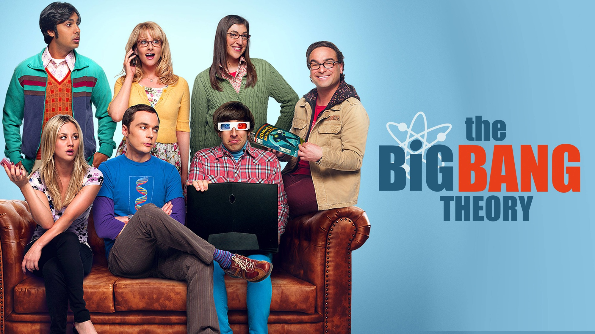

# Face Detection Project



## Features
- Face detection in images and videos.
- Classification of characters from the series "The Big Bang Theory".
- Data augmentation to improve model accuracy.
- Training a convolutional neural network using TensorFlow and Keras.
- Real-time detection results visualization.

## Requirements
- Python 3.9 or higher
- TensorFlow
- OpenCV
- Matplotlib
- Albumentations
- Scikit-learn
- BeautifulSoup4
- LabelMe

## How to Run
1. Clone the repository.
2. Install the dependencies using the command:
   ```bash
   %pip install -q labelme bs4 tensorflow opencv-python matplotlib albumentations scikit-learn
   ```
3. Run the notebook `face_detection.ipynb` to train the model and perform face detection.

## Algorithm Layout
1. Import libraries and install dependencies.
2. Configure directories and helper functions.
3. Collect and annotate images.
4. Split data into training, validation, and test sets.
5. Perform data augmentation.
6. Load images and labels into TensorFlow datasets.
7. Build and train the neural network.
8. Evaluate and visualize the results.

## Structure and Network Used
- Uses the pre-trained VGG16 network as a base.
- Adds global pooling and dense layers for classification and bounding box regression.
- Model built using the Keras functional API.

## Bugs and Implementations to be Fixed
- Improve face detection accuracy under varying lighting conditions.
- Fix augmentation issues resulting in invalid bounding boxes.
- Implement regularization techniques to avoid overfitting.
- Add support for detecting multiple faces in a single image.
